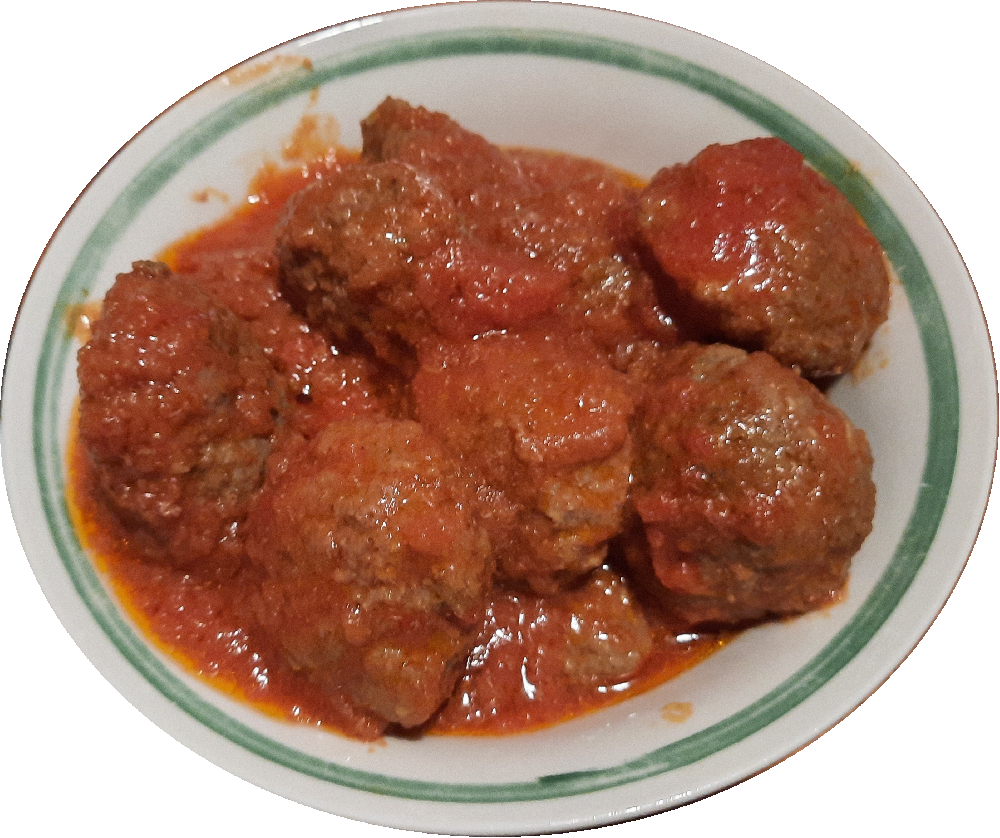

# Meatballs
### Beef meatballs in tomato sauce.
#### You will need a food processor.

***

## Ingredients
- 2 Onions, finely chopped <one mix for gb one for pot> 
- Ground Beef
- 1/2 Cup of Oil
- 2 1/2 Cup of Water
- 1 1/2 tablespoon salt
- 1 tablespoon coriander powder
- 1 tablespoon black pepper
- 1 tablespoon garlic powder
- 1 1/2 tablespoon tomato paste

## Instructions
- Blend onions in the food processor until they are finely chopped.
- Mix ground beef with
  - 1 onion's worth of the chop (make this worded better)
  - 1 teaspoon garlic powder
  - 1 teaspoon of salt
  - 1 teaspoon of coriander powder
  - 1 teaspoon of black pepper
- Make each meatball the size of your palm.
- Pour 1/2 cups of oil, 2 1/2 cups of water, 1 onion chopped, and 1/2 tablespoon salt in a pot.
- Leave this to simmer.
- Place each meatball in the pot.
- When the onions dissolve or melt, pour 1 1/2 tablespoons of tomato paste and leave to boil.
- When some water has evaporated or turned to steam, it is done.

***

