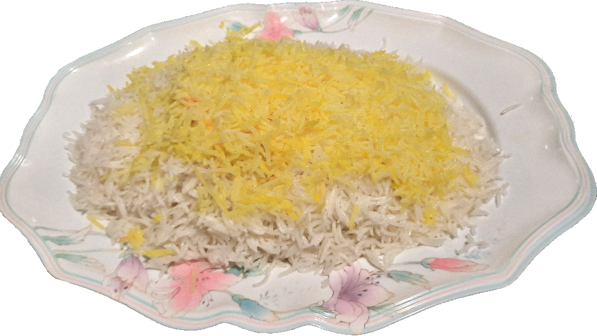

# White Rice (Chalau)
### Plain white rice.

***

## Ingredients
- Long Grain White Rice
  - Basmati (We use this kind)
  - Jasmine

## Instructions
- Leave rice underwater for 30 minutes or for 1 hour
- Drain water
- Repeat until grains are white
- Boil water
- Pour rice into the boiling water
- Boil until grains are fluffy & longer than they were.

***

### Note: The yellow rice on top is made with saffron, which I did not say here.

